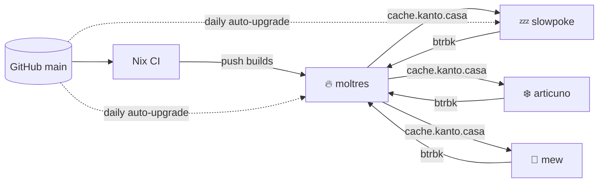

<h1 align="center">🗺️ kanto</h1>

<p align="center">
  <em>One flake for every machine in the region.</em>
</p>

<p align="center">
  <a href="https://github.com/LoneKirov/nix-config/actions/workflows/nix-ci.yml"></a>
  <a href="https://nixos.org"></a>
  <a href="https://flake.parts"></a>
  <a href="https://github.com/jj-vcs/jj"></a>
</p>

---

| | Host | Role |
|---|---|---|
| ❄️ | **articuno** | Workstation: NVIDIA, niri + DankMaterialShell |
| 🪟 | **articuno-wsl** | NixOS on WSL |
| 🧬 | **mew** | Framework laptop: niri + DankMaterialShell |
| 🔥 | **moltres** | Home server: media, SSO, binary cache, backups |
| 💤 | **slowpoke** | Raspberry Pi 3: Tailscale exit node |

Hosts and their roles are declared in [`hosts/default.nix`](hosts/default.nix); the shared modules in [`modules/`](modules) turn those roles into config.



## 🚀 Deploying

```sh
nh os switch                                               # this machine
nh os switch --target-host moltres --build-host moltres    # a server
```

- Remote deploys build on the target, since only CI may push unsigned paths into another host's store.
- slowpoke only installs what's already in the cache. After CI finishes on `main`, let it upgrade on its own or run `systemctl start nixos-upgrade` on it.
